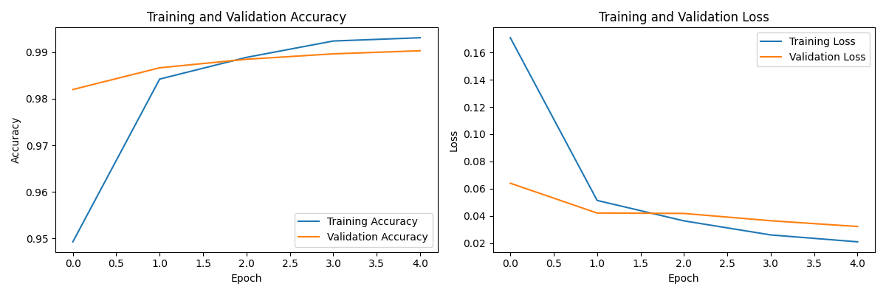
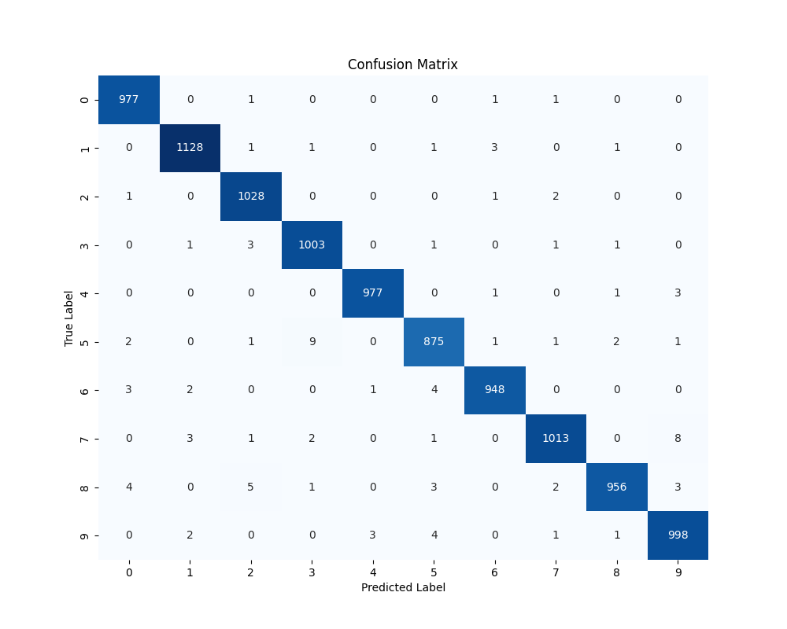
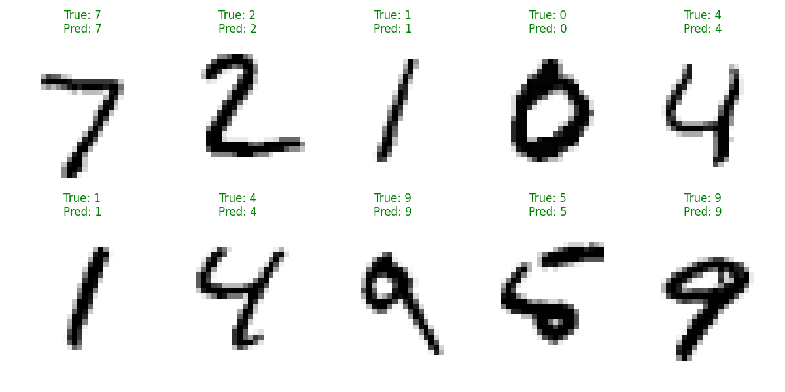

# MNIST Handwritten Digit Classifier

## Project Overview

This project implements a Convolutional Neural Network (CNN) to classify handwritten digits (0-9) from the widely-used MNIST dataset. It serves as a foundational exercise in deep learning for image classification, demonstrating key concepts such as data preprocessing, CNN architecture design, model training, and evaluation.

## Features

*   **Data Loading & Preprocessing:** Efficient loading of the MNIST dataset and preparation of image data (reshaping, normalization) and labels (one-hot encoding).
*   **Convolutional Neural Network (CNN):** Implementation of a custom CNN architecture designed for image feature extraction and classification.
*   **Model Training:** Training the CNN on the MNIST dataset with specified epochs and batch size.
*   **Model Evaluation:** Assessment of model performance using accuracy and loss metrics on a dedicated test set.
*   **Performance Visualization:** Plots for training/validation accuracy and loss history, and a confusion matrix to analyze classification performance.
*   **Prediction Examples:** Visualization of model predictions on sample test images.

## Technologies Used

*   **Python** (3.13.4)
*   **TensorFlow / Keras** (for building and training the neural network)
*   **NumPy** (for numerical operations)
*   **Matplotlib** (for plotting and visualization)
*   **Seaborn** (for enhanced visualizations, especially the confusion matrix)
*   **Jupyter Notebook** (for interactive development and presentation)
*   **Scikit-learn** (for `confusion_matrix`)

## Getting Started

Follow these instructions to set up the project and run the notebook on your local machine.

### Prerequisites

*   Python 3.x installed on your system.
*   A terminal or command prompt.

### Installation

1.  **Clone the repository:**
    ```bash
    git clone https://github.com/YOUR_USERNAME/MNIST_Handwritten_Digit_Classifier.git
    cd MNIST_Handwritten_Digit_Classifier
    ```
    (Replace `YOUR_USERNAME` with your GitHub username and `MNIST_Handwritten_Digit_Classifier` with your repository name if different.)

2.  **Create and activate a virtual environment (recommended):**
    ```bash
    python -m venv mnist_env
    # On Windows:
    .\mnist_env\Scripts\activate
    # On macOS/Linux:
    source mnist_env/bin/activate
    ```

3.  **Install the required Python packages:**
    ```bash
    pip install -r requirements.txt
    ```
    *(If you haven't created `requirements.txt` yet, run `pip freeze > requirements.txt` in your active `mnist_env` first.)*

4.  **Install the virtual environment as a Jupyter kernel:**
    ```bash
    python -m ipykernel install --user --name=mnist_env --display-name "Python (mnist_env)"
    ```

5.  **Launch Jupyter Notebook:**
    ```bash
    jupyter notebook
    ```

6.  **Open the Notebook:** In your web browser, navigate to and open `mnist_classifier.ipynb`.
7.  **Select the Kernel:** Ensure the notebook is using the `Python (mnist_env)` kernel (go to `Kernel -> Change kernel` in the Jupyter menu).
8.  **Run All Cells:** Execute all cells in the notebook to see the model in action.

## Model Architecture

The CNN architecture used in this project is a sequential model consisting of:

*   **Input Layer:** `Input(shape=(28, 28, 1))`
*   **Convolutional Layers:** Two `Conv2D` layers with ReLU activation, followed by `MaxPooling2D` layers for downsampling.
    *   First `Conv2D`: 32 filters, (3,3) kernel size.
    *   Second `Conv2D`: 64 filters, (3,3) kernel size.
*   **Flatten Layer:** Converts the 2D feature maps into a 1D vector.
*   **Dense Layers:** Two fully connected `Dense` layers with ReLU activation.
    *   First `Dense`: 64 units.
    *   Second `Dense` (Output): 10 units with `softmax` activation for multi-class classification (digits 0-9).
*   **Optimizer:** Adam
*   **Loss Function:** Categorical Crossentropy
*   **Metrics:** Accuracy

*(If you added Dropout layers, mention them here too!)*

## Results

After training for [X] epochs, the model achieved the following performance on the test set:

*   **Test Accuracy:** ~[Your Accuracy]% (e.g., 99.25%)
*   **Test Loss:** ~[Your Loss Value] (e.g., 0.025)

### Training History

*(Include a screenshot of your training/validation accuracy and loss plot here. You can drag and drop images directly into the GitHub README editor or use markdown image syntax.)*


*Example: Replace with your actual plot*

### Confusion Matrix

*(Include a screenshot of your confusion matrix here.)*


*Example: Replace with your actual plot*

### Sample Predictions

*(Include a screenshot of your sample predictions plot here, showing correct and incorrect predictions.)*


*Example: Replace with your actual plot*

## Future Work / Improvements

*   **Data Augmentation:** Implement data augmentation techniques (e.g., rotation, shifting, zooming) to improve model generalization and robustness.
*   **Hyperparameter Tuning:** Experiment with different learning rates, batch sizes, and optimizer configurations.
*   **Advanced Architectures:** Explore more complex CNN architectures like ResNet, VGG, or Inception, potentially using transfer learning.
*   **Regularization:** Add more regularization techniques (e.g., L1/L2 regularization) to further prevent overfitting.
*   **Deployment:** Create a simple web application (e.g., using Streamlit or Flask) to allow users to upload their own handwritten digits for classification.

## License

This project is open-sourced under the [MIT License](LICENSE).
